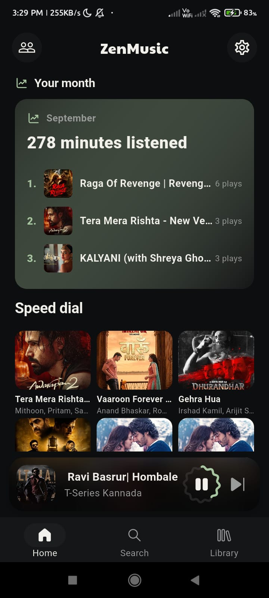
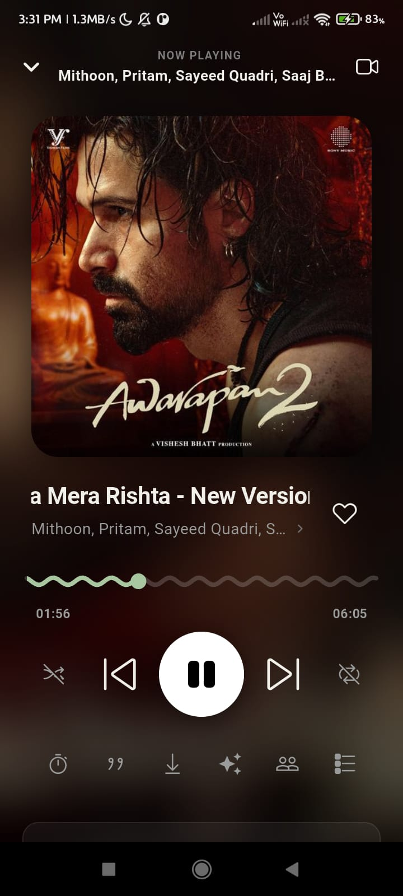
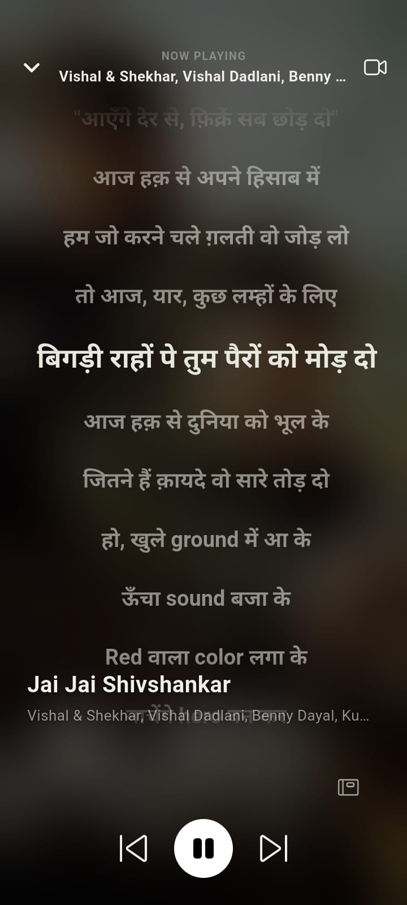
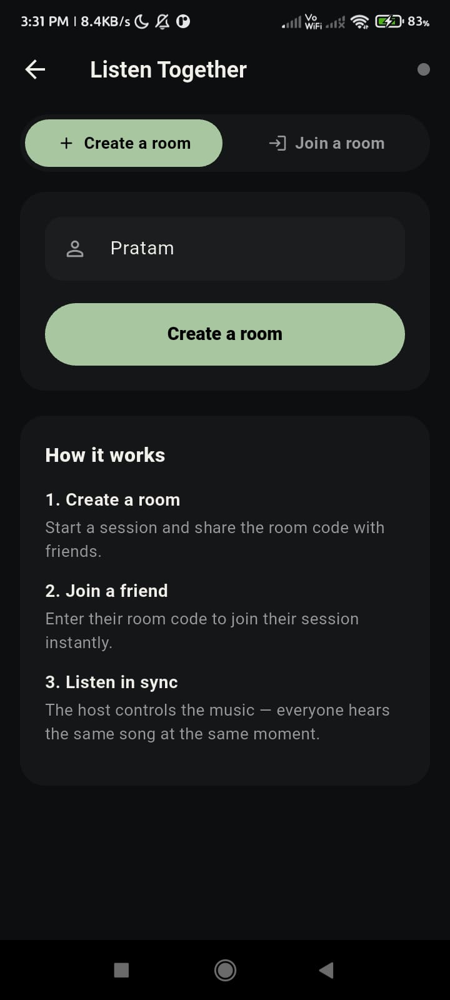
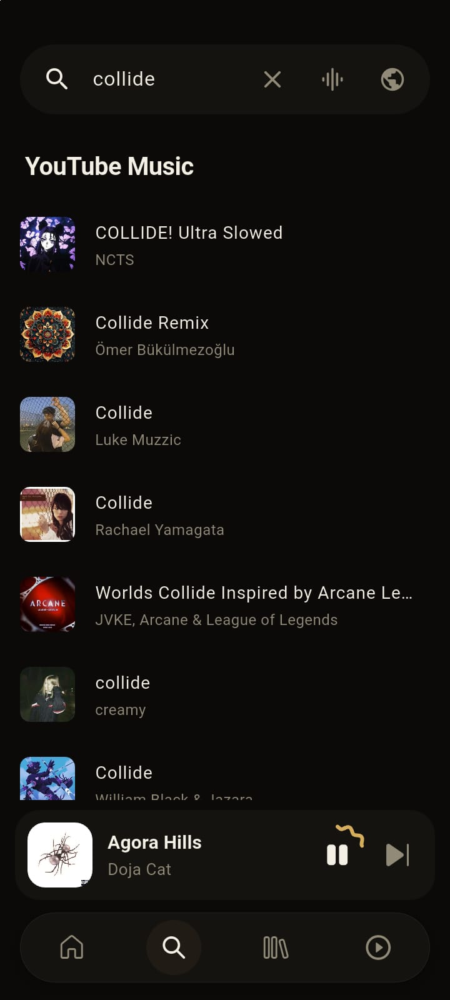
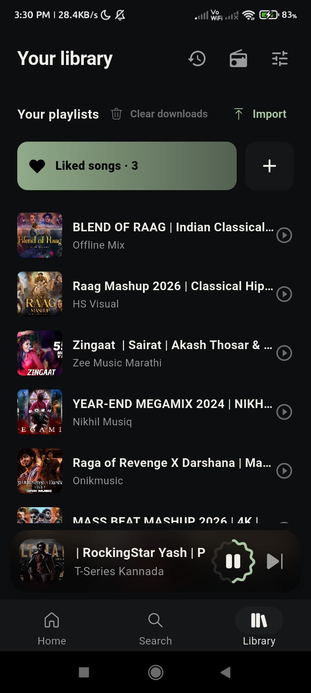
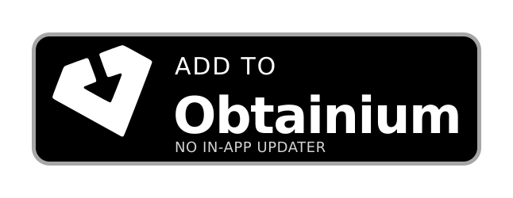
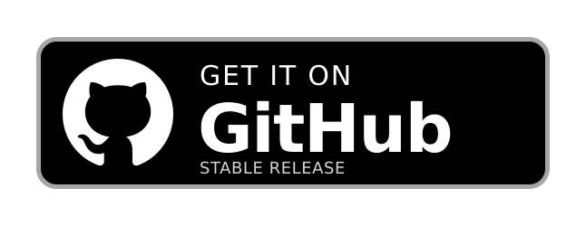

<div align="center">


# ZenMusic

### Multi-source music player for Android

<br/>

[](https://github.com/vorlon-dev/Zen-music/releases)
[](https://github.com/vorlon-dev/Zen-music/blob/main/LICENSE)
[](https://github.com/vorlon-dev/Zen-music/releases)

<br/>

[**Download**](#download-now) · [**Features**](#features) · [**Build**](#building-from-source) · [**Contribute**](#contributing) · [**Legal**](#legal)

</div>

> [!IMPORTANT]
> ZenMusic is still in development. Features may change and you may run into bugs. Updates are delivered through GitHub Releases.

> [!NOTE]
> **Regional availability** - If YouTube Music or JioSaavn is unavailable in your region, that source may not work without a **VPN or proxy** connecting to a supported region.

---

<div align="center">

<h1><a id="screenshots"></a>Screenshots</h1>








</div>

---

<div align="center">

<h1><a id="features"></a>Features</h1>

<table>
  <tr>
    <td width="50%" valign="top">

#### Playback
- Multi-source streaming: JioSaavn (320 kbps AAC) and YouTube Music
- Source extensions
- Offline downloads
- Sleep timer with end-of-song option

</td>
    <td width="50%" valign="top">

#### Audio
- System equalizer
- Bass and treble controls

</td>
  </tr>
  <tr>
    <td width="50%" valign="top">

#### Lyrics & Discovery
- Time-synced lyrics (LRCLIB)
- Adjustable lyric size, spacing and alignment
- Song recognition: identify music playing around you

</td>
    <td width="50%" valign="top">

#### Library
- Import playlists from Spotify (CSV export)
- Download and manage songs offline

</td>
  </tr>
  <tr>
    <td width="50%" valign="top">

#### Social
- Listen Together: create a room, share the code, and listen in sync
- Host controls playback for everyone

</td>
    <td width="50%" valign="top">

#### Interface
- Ambient mode: landscape player with animated glow from album art
- Player background styles
- Three progress slider styles
- Thumbnail radius, haptics and more
- OTA update checks via GitHub Releases: download once, install whenever you're ready

</td>
  </tr>
</table>

</div>

---

<div align="center">

<h1><a id="download-now"></a>Download Now</h1>

<h2>Stable Release</h2>

<table>
  <tr>
    <th align="center">Obtainium</th>
    <th align="center">GitHub</th>
  </tr>
  <tr>
    <td align="center">
      <a href="https://apps.obtainium.imranr.dev/redirect?r=obtainium://add/https://github.com/vorlon-dev/Zen-music/">
        
      </a>
    </td>
    <td align="center">
      <a href="https://github.com/vorlon-dev/Zen-music/releases/latest">
        
      </a>
    </td>
  </tr>
  <!-- Uncomment each store once the listing is live, and replace YOUR.PACKAGE.NAME / YOUR-OPENAPK-SLUG.
  <tr>
    <th align="center">IzzyOnDroid</th>
    <th align="center">OpenAPK</th>
  </tr>
  <tr>
    <td align="center">
      <a href="https://apt.izzysoft.de/fdroid/index/apk/YOUR.PACKAGE.NAME">
        
      </a>
    </td>
    <td align="center">
      <a href="https://www.openapk.net/YOUR-OPENAPK-SLUG/YOUR.PACKAGE.NAME/">
        
      </a>
    </td>
  </tr>
  -->
</table>

<h2>Nightly Build</h2>

<table>
  <tr>
    <th align="center">GitHub</th>
  </tr>
  <tr>
    <td align="center">
      <a href="https://github.com/vorlon-dev/Zen-music/releases/tag/nightly">
        
      </a>
    </td>
  </tr>
</table>

</div>

---

<h1 align="center"><a id="building-from-source"></a>Building from Source</h1>

ZenMusic targets **Android only**.

```bash
git clone https://github.com/vorlon-dev/Zen-music.git
cd Zen-zen
flutter pub get
flutter run                  # with a connected Android device or emulator
```

Release APKs (what the download badges serve):

```bash
flutter build apk --release --split-per-abi   # per-ABI splits
flutter build apk --release                   # universal APK
```

If no keystore is configured, release builds fall back to debug signing so the build still works. Use your own release keystore for any APK you distribute, because Android only installs updates signed with the same key.

---

<div align="center">

<h1><a id="contributing"></a>Contributing</h1>

<h3>Contributions are welcome!</h3>

</div>

1. Fork the repository.
2. Create a branch for your change:
   ```bash
   git checkout -b feature/my-feature
   ```
3. Make your changes and commit with a clear message.
4. Push to your fork and open a Pull Request describing what changed and why.

Please keep pull requests focused on a single change, and test on a real device before submitting.

---

<div align="center">

<h1>Special Thanks</h1>

<h3>ZenMusic stands on the shoulders of incredible open-source work.</h3>

<h3>Main Inspirations</h3>

<table>
  <thead>
    <tr>
      <th align="center">Project</th>
      <th align="center">Contribution</th>
    </tr>
  </thead>
  <tbody>
    <tr>
      <td align="center"><strong>Echo nightly</strong></td>
      <td>Extension implementation</td>
    </tr>
    <tr>
      <td align="center"><strong>Echo music</strong></td>
      <td>UI design language, Listen Together client, recognition engine, Apple Music canvas and welcome dialog</td>
    </tr>
    <tr>
      <td align="center"><strong>Metrolist / metroserver</strong></td>
      <td>Listen Together server protocol and deployment</td>
    </tr>
    <tr>
      <td align="center"><strong>Musify</strong></td>
      <td>Streaming and app architecture reference</td>
    </tr>
  </tbody>
</table>

<h3>Libraries & Integrations</h3>

<table>
  <thead>
    <tr>
      <th align="center">Project</th>
      <th align="center">Contribution</th>
    </tr>
  </thead>
  <tbody>
    <tr>
      <td align="center"><code>youtube_explode_dart</code> / <code>yt_extractor</code></td>
      <td>YouTube stream extraction</td>
    </tr>
    <tr>
      <td align="center"><code>audio_service</code> / <code>just_audio</code></td>
      <td>Playback engine</td>
    </tr>
    <tr>
      <td align="center"><code>flutter_lyric</code></td>
      <td>Lyrics rendering</td>
    </tr>
    <tr>
      <td align="center"><a href="https://lrclib.net/"><strong>LRCLIB</strong></a></td>
      <td>Synced lyrics provider</td>
    </tr>
    <tr>
      <td align="center"><strong>Shazam discovery API / dejavu-fingerprinter</strong></td>
      <td>Song recognition</td>
    </tr>
    <tr>
      <td align="center"><strong>Music Recognizer</strong></td>
      <td>Recognition flow reference</td>
    </tr>
  </tbody>
</table>

<h3>We also thank the entire open-source community! For every library, tool, and API that powers this project.</h3>

</div>

---

<div align="center">

<h1>Contributors</h1>

<h3>This project wouldn't exist without these amazing people!</h3>

<a href="https://github.com/vorlon-dev/Zen-music/graphs/contributors">
  
</a>

</div>

---

<div align="center">

<h1><a id="legal"></a>Legal</h1>

ZenMusic is a fully open-source project created for educational purposes and personal use. It is not monetized in any way: there are no advertisements, premium features or subscriptions.

The app acts strictly as a client to publicly available content and APIs of the platforms it supports. We do not host, upload, distribute or store any audio, video or copyrighted media files. All content is served by the respective platforms and remains the property of its copyright owners.

This project is **not affiliated with, authorized, or endorsed by** YouTube, Google LLC, JioSaavn, or any of their affiliates. All trademarks and intellectual property rights belong to their respective owners.

This software is provided "AS IS", without warranty of any kind. Users are solely responsible for ensuring their usage complies with their local copyright laws and the Terms of Service of the platforms they access.

Licensed under [GPL-3.0](LICENSE)

</div>

---

<div align="center">

<br/>

**Made with ❤️ by [vorlon-dev](https://github.com/vorlon-dev)**

</div>